# 🌿 منصة إدمارك للتجارة الإلكترونية

متجر إلكتروني متكامل مبني بـ **PHP 8 + MySQL + Bootstrap 5** — تطوّر من مشروع جامعي (2017) إلى منصة بيع حديثة وآمنة: سلة حية، دفع متعدد الطرق، لوحة تحكم، تقارير، كوبونات، تقييمات والمزيد.

> 🇬 English version: [README.md](README.md)

## 🎥 العرض التجريبي 

[](https://youtu.be/gYdKw-2fKjY)

## ✨ الميزات

### 🛒 تجربة العميل
- كتالوج منتجات مع **بحث + تصنيفات + فرز + ترقيم صفحات**
- سلة حية لكل مستخدم (AJAX بدون تحميل) مع عدّاد كمية ذكي وكوبونات خصم
- دفع متعدد: عند الاستلام، **13 محفظة يمنية**، 7 شركات صرافة، بطاقات عالمية (محاكاة بوابة مع فحص Luhn وكشف نوع البطاقة)، وتقسيط (تمارا / تابي)
- تتبع الطلبات بصفحة "طلباتي" + إيميلات تأكيد تلقائية
- تقييمات ومراجعات بنجوم، زر واتساب عائم، واستعادة كلمة المرور برابط مؤقت وعدّاد تنازلي حي

### 🛡️ الأمان
- تشفير كلمات المرور **bcrypt** مع ترقية تلقائية للهاش القديم
- Prepared Statements + CSRF + تعقيم مخرجات XSS
- Rate Limiting للدخول والاستعادة، مناطق أدمن محمية، رفع صور مُتحقق منه (نوع + حجم)

### 👨‍💼 لوحة التحكم
- الطلبات: تأكيد / إلغاء مع إرجاع تلقائي للمخزون + بيانات التوصيل
- المنتجات + التصنيفات، المستخدمون والصلاحيات، الكوبونات — تحرير حي عبر AJAX (حفظ فردي وكلي)
- **مخزون حي**: خصم تلقائي مع كل طلب + شارات انخفاض / نفاد المخزون
- تقارير KPI برسوم Chart.js + قراءات إدارية تلقائية + تصدير CSV يدعم العربية
- نسخ احتياطي لقاعدة البيانات بضغطة واحدة

## 📸 لقطات الشاشة

### 🛍️ واجهة المتجر

| الرئيسية | البحث والتصنيفات | التفاصيل والتقييمات |
|:---:|:---:|:---:|
| 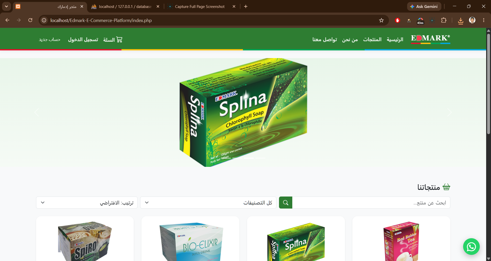 | 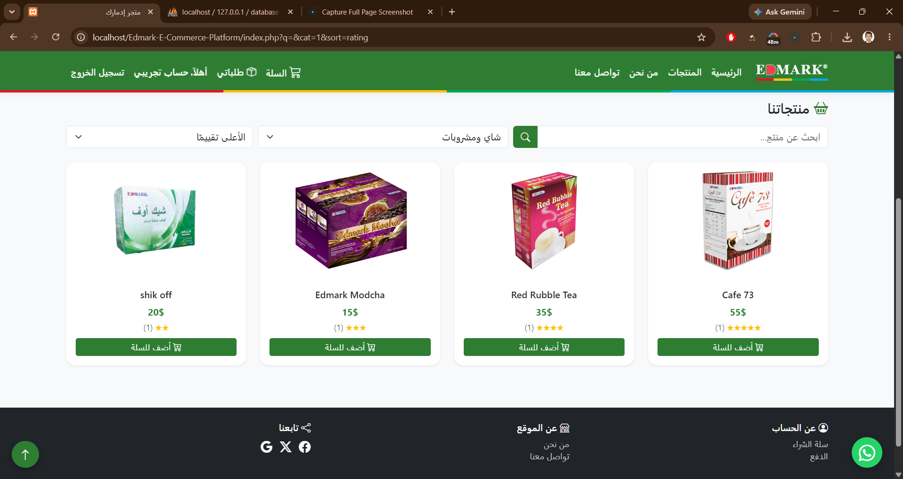 | 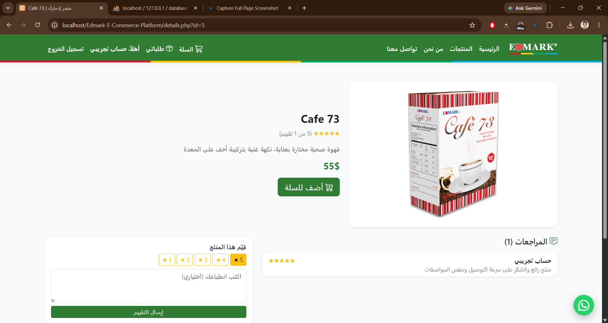 |

| السلة + كوبون | الدفع | طلباتي |
|:---:|:---:|:---:|
| 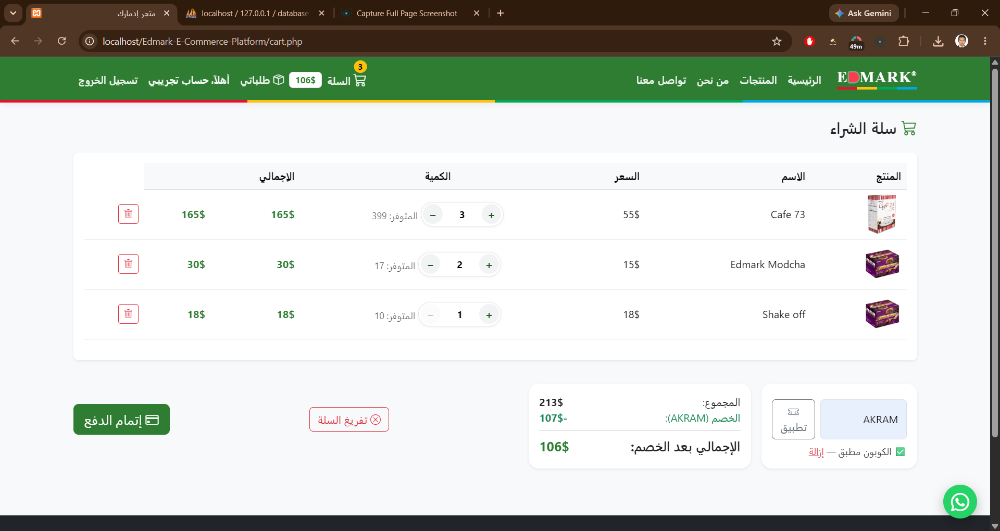 | 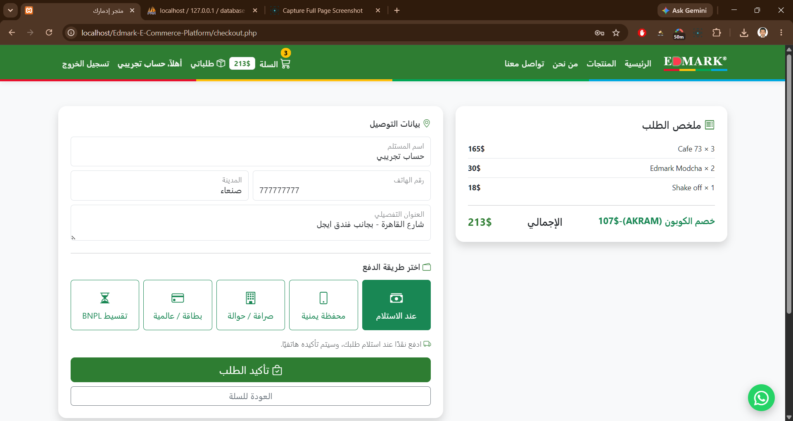 | 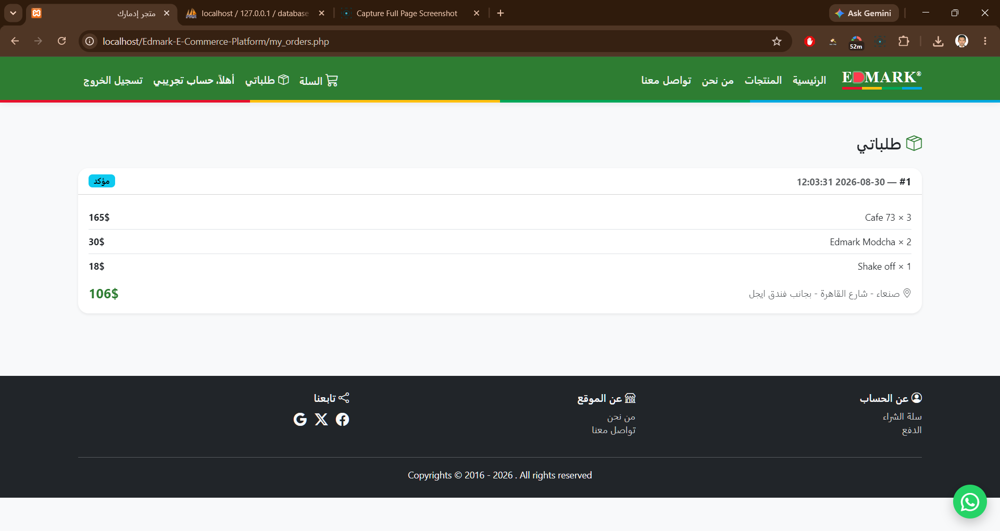 |

| استعادة كلمة المرور ⏱️ | إيميل التأكيد | عرض الجوال 📱 |
|:---:|:---:|:---:|
| 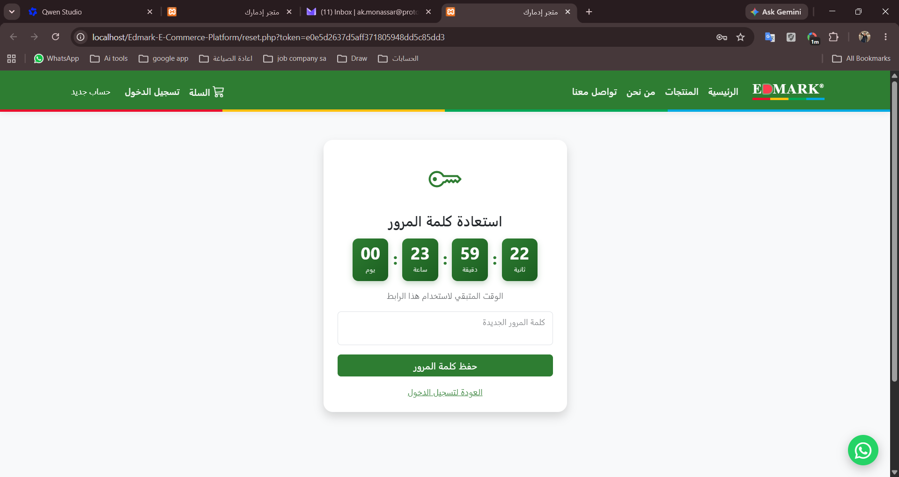 | 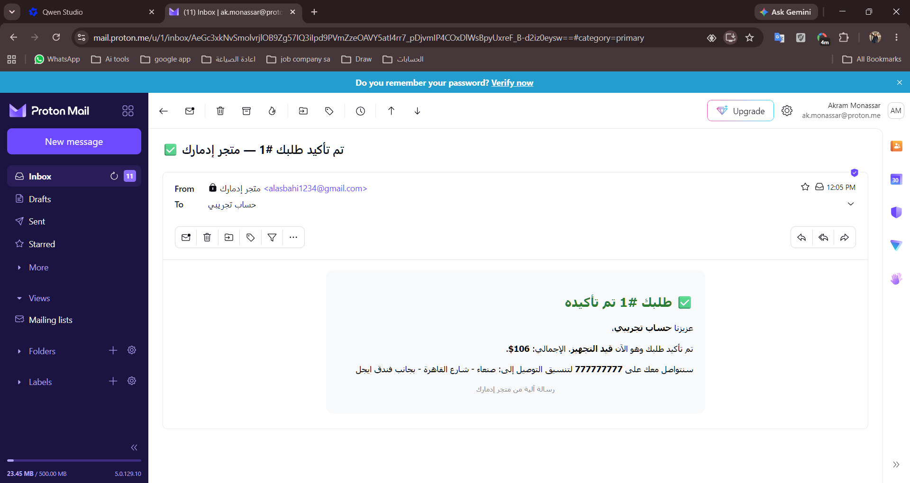 | 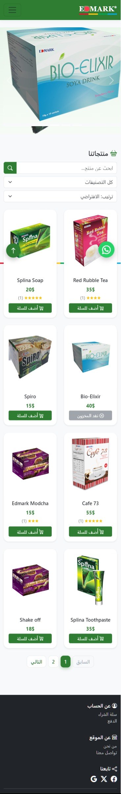 |

### 👨‍💼 لوحة الإدارة

| الإحصائيات | إدارة الطلبات |
|:---:|:---:|
| 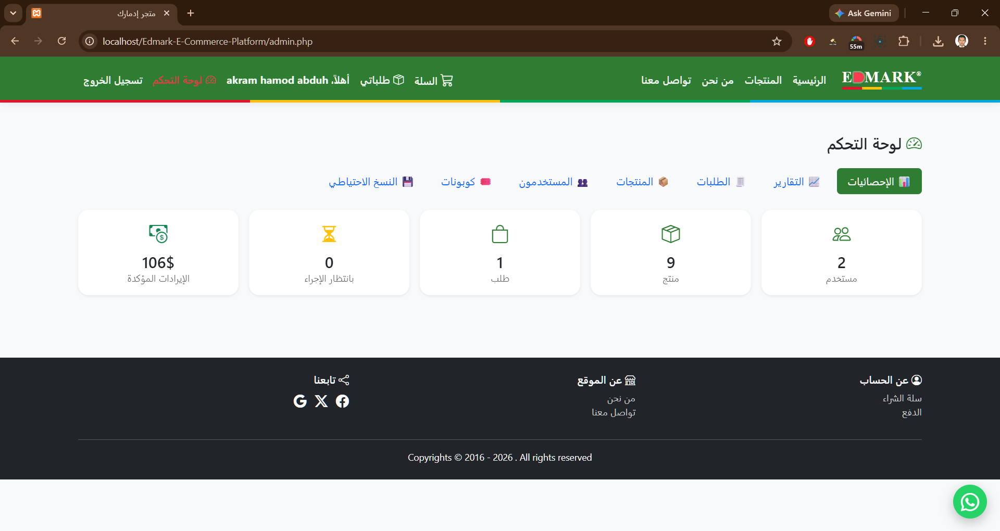 | 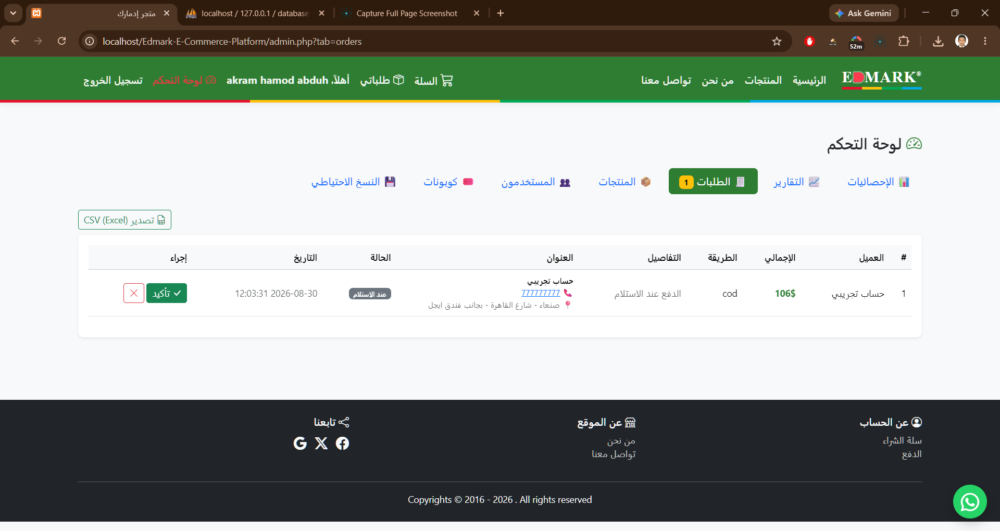 |

| التقارير 📊 | الكوبونات 🎟️ |
|:---:|:---:|
| 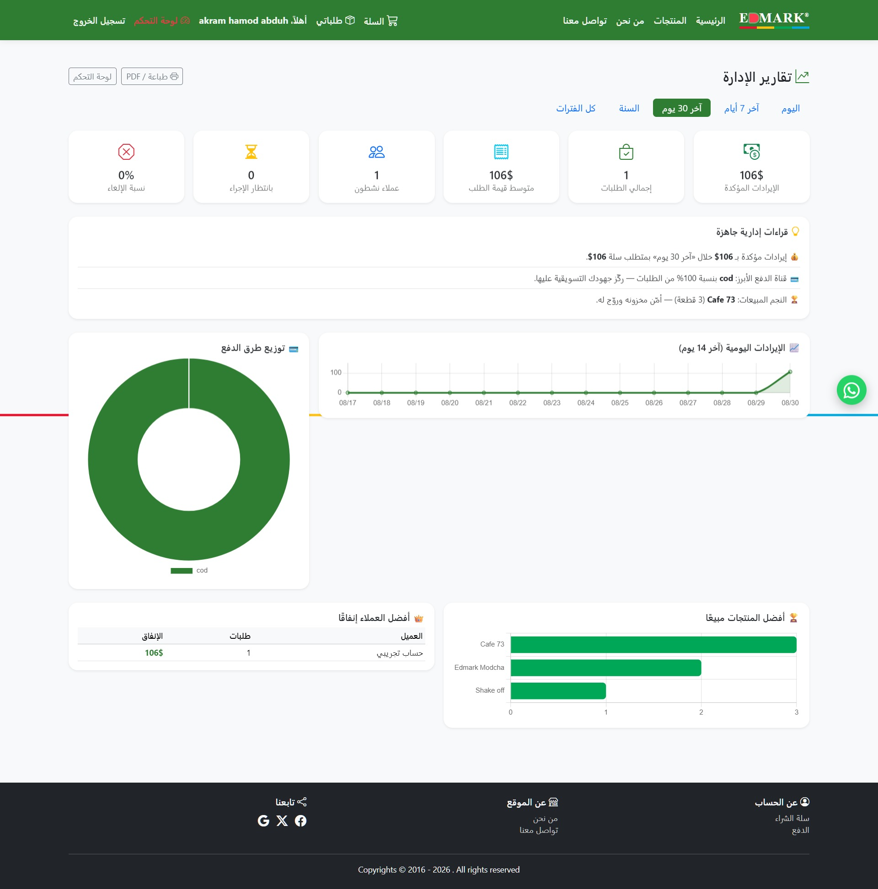 | 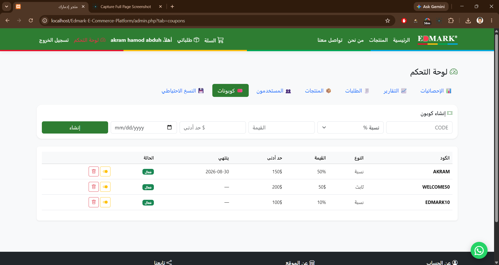 |

## 🚀 التشغيل محليًا

1. ثبّت **XAMPP** وضع المشروع داخل `htdocs/`.
2. استورد `Db/database.sql` من phpMyAdmin.
3. انسخ `connection/connection.example.php` إلى `connection/connection.php` وعبّئ بيانات قاعدة البيانات.
4. انسخ `config/email.example.php` إلى `config/email.php` وعبّئ **App Password** من Gmail (للإيميلات).

**حساب الأدمن التجريبي:** `alasbahi123@gmail.com` / `Admin@2026`

> عند أول تسجيل دخول تُرقّى كلمة المرور تلقائيًا إلى bcrypt.

## 🧰 التقنيات

PHP 8.2 · MySQL/MariaDB · Bootstrap 5 RTL · Chart.js · AOS · PHPMailer · Vanilla JS (Fetch API)

## 📁 هيكل المشروع

```
├── api/            # نقاط JSON (سلة، كوبونات، أدمن AJAX)
├── assets/         # custom.css, admin.js
├── backups/        # نسخ احتياطية (مستبعد من git)
├── Captures/       # لقطات الشرح
├── config/         # إعدادات البريد (مستبعد من git)
├── connection/     # اتصال DB (مستبعد من git)
├── include/        # header / footer / csrf / coupon / mailer / pagination / rate_limit
└── *.php           # صفحات المتجر واللوحة
```

## 🗺️ خارطة التطوير (أربع دفعات)

1. **القلب التجاري** — بيانات توصيل، مخزون حي، طلباتي، إيميلات تأكيد
2. **تجربة التسوق** — بحث / تصنيفات / فرز، واتساب، استعادة كلمة المرور
3. **التسويق** — كوبونات، تقييمات، تصدير CSV
4. **النضج** — Rate limiting، ترقيم صفحات، نسخ احتياطي، SEO

---
مشروع تعليمي تطبيقي — أكرم منصّر
